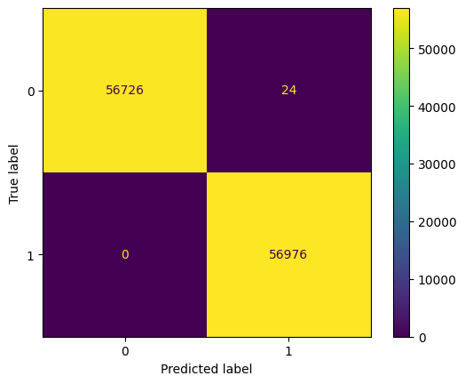
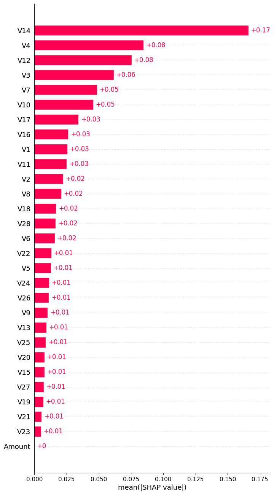
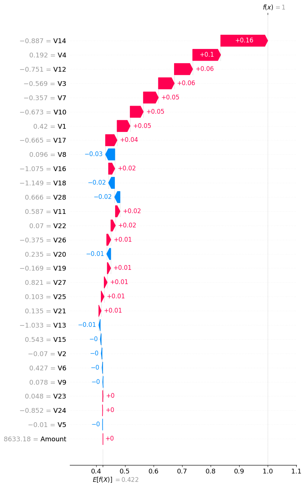

# Analysis for credit card fraud detection

## Background and overview

Secure Swipe Solutions, founded in 2020, is dedicated to handling payments in virtual and physical 
stores across Europe. Currently, it is experiencing exponential growth, handling hundreds of 
thousands of transactions per month. The problem the company faces is the rapid increase in 
fraudulent transactions that cause not only economic losses but also a loss of customer trust.

The company uses a detection system based on static rules, which prove to be inadequate for 
identifying sophisticated patterns for carrying out fraudulent transactions. Fraudsters find 
new ways to beat the system in less time. This produces false positives (legitimate transactions 
classified as fraudulent) and false negatives (fraudulent transactions classified as legitimate).

The company has decided to update the current system with a more advanced one that uses the data 
collected by the company to train models based on machine learning techniques. The goal is to create 
a more accurate and adaptable model.

This project uses transaction data collected by the company to train a machine learning model, which will 
classify transactions to determine if they are legitimate or fraudulent.

The data used is real and comes from anonymized transactions made by users in Europe. Here are 
the [data](https://www.kaggle.com/datasets/nelgiriyewithana/credit-card-fraud-detection-dataset-2023).

## Data structures and initial exploration

SecureSwipe Solutions have 568,630 credit card transactions made by European
 cardholders in 2023. It contains 31 features, divided into four groups. The first
 one uniquely identifies a transaction and only includes the id column. All 
predictors (28 features) in the second group are anonymized as 
V1, V2, ..., V28. The third group represents the transaction amount
 in Euros (Amount). The last group is the target feature (Class) using a
 binary label indicating whether the transaction is fraudulent (1) or 
not (0). The following table illustrates this:

| Feature | Purpose                                                                                  |
|----------------|---------------------------------------------------------------------------------------------|
| id             | Unique identifier for each transaction                          |
| V1             | Anonymized features representing various transaction attributes (e.g., time, location, etc.) |
| V2             | Anonymized features representing various transaction attributes (e.g., time, location, etc.)  |
| V3             | Anonymized features representing various transaction attributes (e.g., time, location, etc.)  |
| V4             | Anonymized features representing various transaction attributes (e.g., time, location, etc.)  |
| V5             | Anonymized features representing various transaction attributes (e.g., time, location, etc.)  |
| V6             | Anonymized features representing various transaction attributes (e.g., time, location, etc.)  |
| V7             | Anonymized features representing various transaction attributes (e.g., time, location, etc.)  |
| V8             | Anonymized features representing various transaction attributes (e.g., time, location, etc.)  |
| V9             | Anonymized features representing various transaction attributes (e.g., time, location, etc.)  |
| V10            | Anonymized features representing various transaction attributes (e.g., time, location, etc.)  |
| V11            | Anonymized features representing various transaction attributes (e.g., time, location, etc.)  |
| V12            | Anonymized features representing various transaction attributes (e.g., time, location, etc.)  |
| V13            | Anonymized features representing various transaction attributes (e.g., time, location, etc.)  |
| V14            | Anonymized features representing various transaction attributes (e.g., time, location, etc.)  |
| V15            | Anonymized features representing various transaction attributes (e.g., time, location, etc.)  |
| V16            | Anonymized features representing various transaction attributes (e.g., time, location, etc.)  |
| V17            | Anonymized features representing various transaction attributes (e.g., time, location, etc.)  |
| V18            | Anonymized features representing various transaction attributes (e.g., time, location, etc.)  |
| V19            | Anonymized features representing various transaction attributes (e.g., time, location, etc.)  |
| V20            | Anonymized features representing various transaction attributes (e.g., time, location, etc.)  |
| V21            | Anonymized features representing various transaction attributes (e.g., time, location, etc.)  |
| V22            | Anonymized features representing various transaction attributes (e.g., time, location, etc.)  |
| V23            | Anonymized features representing various transaction attributes (e.g., time, location, etc.)  |
| V24            | Anonymized features representing various transaction attributes (e.g., time, location, etc.)  |
| V25            | Anonymized features representing various transaction attributes (e.g., time, location, etc.)  |
| V26            | Anonymized features representing various transaction attributes (e.g., time, location, etc.)  |
| V27            | Anonymized features representing various transaction attributes (e.g., time, location, etc.)  |
| V28            | Anonymized features representing various transaction attributes (e.g., time, location, etc.)  |
| Amount         | The transaction amount                                                          |
| Class          | Binary label indicating whether the transaction is fraudulent (1) or not (0)               |

The detailed report can be found on [Kaggle](https://www.kaggle.com/code/christianmontenegro/credit-card-fraud-detection). The
 open standard process model used is [CRISP-DM](https://www.datascience-pm.com/crisp-dm-2/).

## Executive summary

### Overview of Findings

The trained model achieves generalization by obtaining excellent results on different relevant performance metrics. The model
 also can be interpretable by explaining how it makes decisions to give a prediction. The following sections will provide a
 detailed explanation of this.

### Performance

The model achieved excellent performances, using AUC-ROC, sensitivity, accuracy, and F1. The scores 
were 0.99, 1, 0.99, and 0.99, respectively. Another method to evaluate our model involved the use
 of the confusion matrix. The confusion matrix indicated 24 false positives, a relatively small number
 compared to the true positives (56,976). This implies the generalizability of the model. The following image shows the confusion matrix.

### Interpretability

SHAP allow us to discover the influence of features in the prediction process, this led to the discovery that the most
important feature, by far, is V14 with a global average SHAP value of 0.17, which is 212.5% more than the second most important 
feature, V4 with 0.08. It's important to note that the least important feature is the Amount feature. The following image illustrate this.

At the individual predictive level, it allows us to understand a particular decision in more detail for customer
 trust and transparency. When a transaction is labeled as potentially fraudulent, providing a clear
 and understandable explanation can help maintain customer trust. The following waterfall chart illustrates
 how the model decides to predict correctly that a transaction is fraudulent.

## Recommendations and future steps

Based on the knowledge acquired about the patterns of fraudulent and legitimate transactions, 
when training a predictive model with generalization and interpretability capabilities, using 
gradient-boosted decision trees (GBDT), implemented in XGBoost, the following practical recommendations are offered:

- Implement the model in production: Based on the results obtained, the model is sufficiently 
robust to replace the current static rule system.

- Optimize the interface with the client ensuring interpretability: Implement an interface that explains 
decisions to customers. This is essential to maintain customer trust when a legitimate transaction 
is marked as fraudulent.

- Provide support and feedback: Implement an active support system so that customers of the companies 
processing the payments can quickly report problems or questions about the fraud detection system. Feedback 
would improve both the model and the customer experience.

- Monitor key metrics in production: Although the model has demonstrated excellent performance, it is of utmost 
importance to monitor it continuously in production. Fraud strategies evolve rapidly, which is why it is 
necessary to monitor metrics such as the rate of false positives, false negatives, and avoided financial losses.

- Retrain the model periodically: The model should be trained regularly to keep up with identifying new fraud 
patterns. It should be retrained when key performance metrics begin to deteriorate significantly.

- Manually review significant false negatives: Although the model shows high sensitivity, it is essential to 
have a dedicated team that manually reviews the transactions that the model does not flag as suspicious but 
that clients or audit systems later identify as fraudulent. These cases can provide valuable feedback to adjust the model.

- Focus on the key features: The analysis showed that the feature V14 is the most relevant for fraud detection, 
with a global average SHAP value of 0.17, markedly higher than the other features. It is recommended to conduct a 
deeper analysis of what this feature represents and how its data collection or representation in the system can be 
improved. Moreover, since the amount of money transferred ('Amount') was identified as the least important 
characteristic, the weight assigned to this variable in other decision systems could be reconsidered.